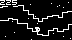

# ThumbyWorks 

Making mini games for [Thumby&trade;](https://thumby.us/).

You have to transfer ["obnlib.py"](lib/obnlib.py) and ["obnfont.bin"](lib/obnfont.bin) to "/lib" directory of the Thumby&trade; device.

## Products

* OBN-H01 [Micro 2048](Games/Micro2048/Micro2048.py)
  * Tiles with the same number merge into one when they touch. Add them up to reach 2048 and more.
  * D-pad: slide panels / A: undo / B: back to title\
     
* OBN-H02 [Hollow Seeker](Games/HollowSeeker/HollowSeeker.py)
  * Go forward in right direction. Seek a hollow as refuge not to be crushed.
  * D-pad left: move left / D-pad right or A: move right / B: pause\
     

## License

These codes are licensed under [MIT License](LICENSE).
